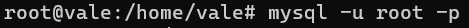
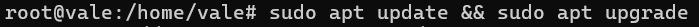
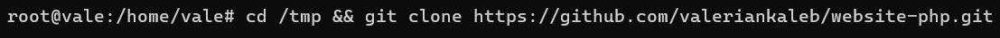
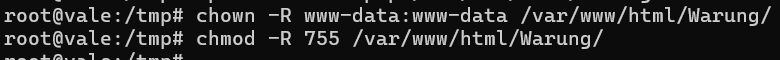
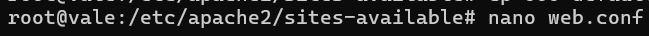
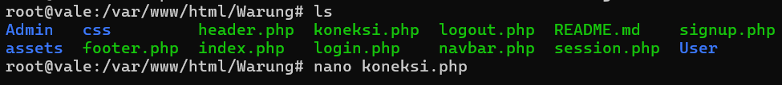
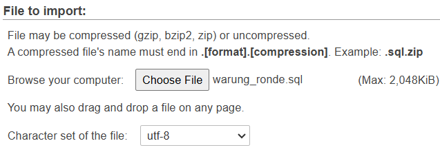
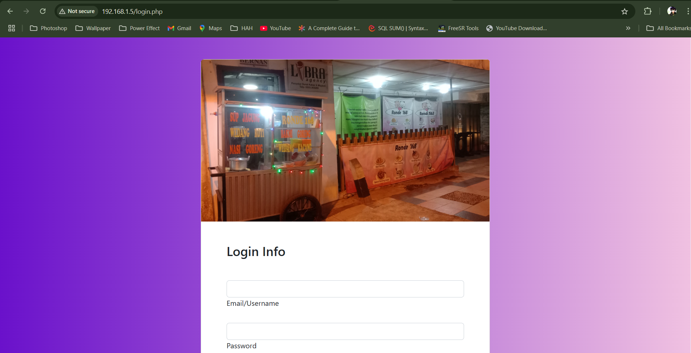
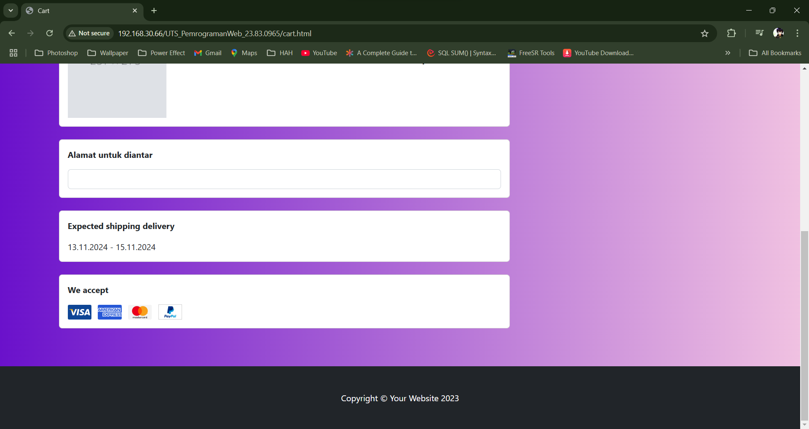

## VALERIAN KALEB SETIAWIRAWAN---FINAL-PROJECT-OS-SERVER-&-SYSTEM-ADMIN---23.83.0965
# Judul : Instalasi layanan server untuk hosting web delivery makanan

Repository ini berisi Dokumentasi Instalasi dan Konfigurasi berbagai layanan Server, seperti SSH, Prometheus, FTP, WEB, Database. Saya menggunakan Ubuntu Server versi 22.04 sebagai base operasi sistem saya.
Beberapa Service yang dijelaskan dalam Repository ini masih dalam proses pengembangan, artinya masih ada beberapa service yang progressnya masih 50% jadi, kedepannya akan dikembangkan lagi.

Update: Progress telah mencapai 99%, dan ada kemungkinan masih akan dikembangkan lagi kedepannya
Update: Progress kurang lebih telah selesai 100%

Progress:
- 19 November 2024: Penentuan tema yang di Install
- 29 November 2024: Penyelesaian tahap pertama
- 3 December 2024: Pergantian Tema
- 7 December 2024: Penyelesaian tahap kedua
- 14 December 2024: Penyelesaian tahap ketiga
- 24 December 2024: Penyelesaian

# Versi layanan yang digunakan
1. Mysql: mysql  Ver 8.0.40-0ubuntu0.22.04.1 for Linux on x86_64
2. PHP: PHP 8.1.2-1ubuntu2.20 (cli)
3. Apache: Apache/2.4.52 (Ubuntu)
4. Operation System: Ubuntu Server 22.04 LTS
5. vsftpd: version 3.0.5
6. Bind9: BIND 9.18.28-0ubuntu0.22.04.1-Ubuntu (Extended Support Version)
7. OpenSSH: OpenSSH_8.9p1 Ubuntu-3ubuntu0.10
8. Grafana: Version 11.4.0

## Daftar Isi
1. [Instalasi dan Konfigurasi SSH](#1-instalasi-dan-konfigurasi-ssh-server)
2. [Instalasi dan Konfigurasi FTP server vsftpd](#2-Instalasi-dan-Konfigurasi-FTP-server-vsftpd)
3. [Instalasi dan Konfigurasi Database Server](#3-instalasi-dan-konfigurasi-database-server)
4. [Instalasi dan Konfigurasi Web Server](#4-instalasi-dan-konfigurasi-web-server)
5. [Instalasi dan Konfigurasi Grafana](#5-instalasi-dan-konfigurasi-grafana)

## 1. Instalasi dan Konfigurasi SSH Server
Kita akan menggunakan SSH agar mempermudah kita dalam mengontrol dan memodifikasi server secara remote
### 1.1 Instalasi SSH
**Langkah 1: Lakukan Update paket Ubuntu**
```
apt update
```


**Langkah 2: Lakukan Instalasi Paket SSH Server**
```
apt-get install openssh-server
```
### 1.2 Konfigurasi SSH
**Langkah 1: Buka Direktori konfigurasi ssh dengan text editor(disini saya menggunakan nano)**
```
nano /etc/ssh/sshd_config
```


**Langkah 2: Edit Konfigurasi seperti dibawah ini**


Saya mengubah Port dari 22 ke 4646 untuk mengamankanya agar tidak menggunakan default port.

**Langkah 3: Restart layanan SSH Server**
```
systemctl restart sshd
```


### 1.3 Menguji Konfigurasi
```
ssh root@IPADDR -p 4646
```


Bisa disesuaikan dengan IP dan Port yang anda konfigurasi

### 1.4 Konfigurasi Firewall
**Langkah 1: Mengizinkan lalu lintas TCP yang masuk pada port 4646**
```
ufw allow 4646
```


### 1.5 cek status Firewall
```
ufw status
```


Jika firewall belum aktif, masukkan perintah
```
ufw enable
```

## 2. Instalasi dan Konfigurasi FTP server vsftpd
Kita akan menginstall FTP server untuk mentransfer file antar Ubuntu dengan windows melalui jaringan lokal. Sementara itu, vsftpd (Very Secure FTP Daemon) adalah server FTP yang dapat meningkatkan keamanan, kinerja, dan stabilitas.

### 2.1 Instalasi vsftpd

**Langkah 1: Instalasi Paket vsftpd**
```
apt update
apt install vsftpd
```


### 2.2 Konfigurasi vsftpd
**Langkah 1: Buka Direktori Konfigurasi vsftpd**
```
nano /etc/vsftpd.conf
```


**Langkah 2: Edit Konfigurasi file Seperti dibawah ini**
```
listen=YES
listen_ipv6=NO
anonymous_enable=NO

#HILANGKAN TANDA PAGAR PADA LINE KONFIGURASI DIBAWAH INI#
local_enable=YES
write_enable=YES
local_umask=022
ascii_upload_enable=YES
ascii_download_enable=YES
chroot_local_user=YES
chroot_list_enable=YES
chroot_list_file=/etc/vsftpd.chroot_list
ls_recurse_enable=YES
dirmessage_enable=YES
use_localtime=YES
xferlog_enable=YES
connect_from_port_20=YES

rsa_cert_file=/etc/ssl/certs/ssl-cert-snakeoil.pem
rsa_private_key_file=/etc/ssl/private/ssl-cert-snakeoil.key
ssl_enable=YES

#TAMBAHKAN DI BAGIAN PALING AKHIR
pasv_enable=YES
pasv_enable=Yes
pasv_max_port=10090
pasv_min_port=10100
```
Setelah itu keluar dari tampilan konfigurasi lalu restart vsftpd
```
systemctl restart vsftpd
```


**Langkah 3: cek status vsftpd**
```
nano service vsftpd status
```


**Langkah 4: Konfigurasi UFW Firewall**
Jika Anda telah mengaktifkan firewall UFW, maka Anda perlu membuka port di atas di firewall dengan perintah berikut.
```
sudo ufw allow from any to any port 20,21,10090:10100 proto tcp
```


**Langkah 5: Menyiapkan akun pengguna**
```
useradd rian
passwd rian
sudo mkdir -p /home/ftpnic/ftp
sudo chown nobody:nogroup /home/ftpnic/ftp
sudo chmod a-w /home/ftpnic/ftp
```


**Langkah 6: Menambahkan user baru ke list**
```
nano /etc/vsftpd.chroot_list
#Tambahkan user baru di direktori ini
rian
```


**Langkah 7: Restart Layanan Vsftpd**
```
systemctl restart vsftpd
```


### 2.3 Menguji Konfigurasi

FTP Server ini adalah Tampilan dari FTP client(Menggunakan Filezila)


Jika FTP tidak dapat terhubung, coba matikan ufw firewall dengan cara
```
ufw disable
```

## 3. Instalasi dan Konfigurasi Database Server
Dalam proyek ini, saya melakukan instalasi database server menggunakan MySQL, sebuah sistem manajemen basis data open-source yang kuat. MySQL digunakan untuk menyimpan dan mengelola data yang diperlukan oleh aplikasi dan situs web. Saya juga menginstal phpMyAdmin, antarmuka web yang memudahkan administrasi dan manajemen database MySQL, memungkinkan pengguna untuk dengan mudah membuat, mengedit, dan mengelola basis data melalui antarmuka berbasis web yang intuitif.

### 3.1 Instalasi MySQL

**Langkah 1: Instalasi Paket MySQL**
```
apt update
apt install mysql-server
```


**Langkah 2: Jalankan MySQL**
```
systemctl start mysql.service
systemctl status mysql.service
```


### 3.2 Konfigurasi MySQL
**Langkah 1: Ikuti Konfigurasi dibawah ini**

Peringatan: Mulai Juli 2022, sebuah kesalahan akan terjadi ketika Anda menjalankan skrip `mysql_secure_installation` tanpa konfigurasi lebih lanjut. Alasannya adalah skrip ini akan mencoba mengatur kata sandi untuk akun MySQL root instalasi, tetapi, secara default pada instalasi Ubuntu, akun ini tidak dikonfigurasikan untuk terhubung menggunakan kata sandi.

Hal ini akan membawa skrip ke dalam perulangan rekursif yang hanya dapat Anda hentikan dengan menutup jendela terminal Anda.

Karena skrip `mysql_secure_installation` melakukan sejumlah tindakan lain yang berguna untuk menjaga keamanan instalasi MySQL Anda, Anda tetap disarankan untuk menjalankannya sebelum mulai menggunakan MySQL untuk mengelola data Anda. Namun, untuk menghindari perulangan ini, Anda perlu menyesuaikan terlebih dahulu cara autentikasi pengguna root MySQL Anda.

Pertama, buka prompt MySQL:
```
sudo mysql
```


Kemudian jalankan perintah `ALTER USER` berikut ini untuk mengubah metode autentikasi pengguna root menjadi metode yang menggunakan kata sandi. Contoh berikut ini mengubah metode autentikasi menjadi `mysql_native_password`:
```
ALTER USER 'root'@'localhost' IDENTIFIED WITH mysql_native_password BY 'password';
```


Setelah melakukan perubahan ini, keluarlah dari prompt MySQL:
```
mysql> exit
```
Jalankan scriptnya lagi dengan:
```
mysql_secure_installation
```


Pertanyaan pertama akan menanyakan apakah Anda ingin menyiapkan Plugin Validasi Kata Sandi, yang dapat digunakan untuk menguji kekuatan kata sandi pengguna MySQL baru sebelum menganggapnya valid.

Jika Anda memilih untuk menyiapkan Plugin Validasi Kata Sandi, setiap pengguna MySQL yang Anda buat yang mengautentikasi dengan kata sandi akan diminta untuk memiliki kata sandi yang sesuai dengan kebijakan yang Anda pilih:


Dari sini, Anda dapat menekan Y dan kemudian ENTER untuk menerima default untuk semua pertanyaan berikutnya. Ini akan menghapus beberapa pengguna anonim dan basis data uji, menonaktifkan login root jarak jauh, dan memuat aturan baru ini sehingga MySQL segera menghormati perubahan yang Anda buat.


Setelah skrip keamanan selesai, Anda dapat membuka kembali MySQL dan mengubah metode autentikasi pengguna root kembali ke metode default,` auth_socket`. Untuk mengautentikasi sebagai pengguna root MySQL menggunakan kata sandi, jalankan perintah ini:
```
mysql -u root -p
```


Kemudian kembali menggunakan metode autentikasi default dengan menggunakan perintah ini:
```
ALTER USER 'root'@'localhost' IDENTIFIED WITH auth_socket;
```


Namun saya memilih untuk membiarkan metode autentikasi pengguna root tetap `mysql_native_password`
### 3.3 Instalasi dan Konfigurasi Phpmyadmin

**Langkah 1: Lakukan instalasi paket**
```
apt-get install phpmyadmin
```


**Langkah 2: Konfigurasi Phpmyadmin**
Peringatan: Saat prompt muncul, “apache2” disorot, tetapi tidak dipilih. Jika Anda tidak menekan SPASI untuk memilih Apache, installer tidak akan memindahkan file yang diperlukan selama instalasi. Tekan SPASI, TAB, lalu ENTER untuk memilih Apache.


Jika anda tetap membiarkan metorde autentikasi pengguna root tetap `mysql_native_password`, maka akan memicu kesalahan saat Anda mencoba mengatur kata sandi untuk pengguna phpmyadmin:


Untuk mengatasinya, pilih opsi batalkan untuk menghentikan proses instalasi. Kemudian, buka prompt MySQL Anda:
```
mysql -u root -p
```


Dari prompt, jalankan perintah berikut untuk menonaktifkan komponen Validasi Kata Sandi. Perhatikan bahwa ini tidak akan benar-benar menghapus instalasinya, tetapi hanya menghentikan komponen agar tidak dimuat pada server MySQL Anda:
```
UNINSTALL COMPONENT "file://component_validate_password";
```


Kemudian keluar dari MySQL client dan menginstal paket phpmyadmin lagi
```
apt-get install phpmyadmin
```


Setelah phpMyAdmin terinstal, Anda dapat membuka prompt MySQL sekali lagi dengan sudo mysql atau mysql -u root -p lalu jalankan perintah berikut ini untuk mengaktifkan kembali komponen Validasi Kata Sandi:
```
INSTALL COMPONENT "file://component_validate_password";
```


 ### 3.4 Menguji Konfigurasi 

**Langkah 1: aktifkan file konfigurasi Apache untuk phpMyAdmin**
```
a2enconf phpmyadmin.conf
```


**Langkah 2: Mengonfigurasi Akses Kata Sandi untuk Pengguna MySQL Khusus **
Masuk kedalam Shell MySQL lagi lalu buat user
```
mysql -u root -p
CREATE USER 'username'@'localhost' IDENTIFIED WITH mysql_native_password BY 'password';
```

Kemudian, berikan hak istimewa yang sesuai kepada pengguna baru Anda. Sebagai contoh, Anda dapat memberikan hak istimewa kepada pengguna ke semua tabel dalam database, serta kekuasaan untuk menambah, mengubah, dan menghapus hak istimewa pengguna, dengan perintah ini:
```
GRANT ALL PRIVILEGES ON *.* TO 'username'@'localhost' WITH GRANT OPTION;
```
Lalu keluar dari shell
```
mysql> exit
```
**Langkah 3: Akses web interface**
Buka browser lalu isi ip atau domain yang telah di konfigurasi ke kolom pencarian
`https://your_domain_or_IP/phpmyadmin`


login menggunakan akun yang tadi telah dibuat


## 4. Instalasi dan Konfigurasi Web Server
Saya memilih untuk menggunakan Apache2 sebagai server web utama untuk proyek saya daripada Nginx. tidak ada alasan khusus saya memilih apache2,anda bisa memilih Nginx. saya juga akan menginstall CMS wordpress untuk Webserver ini. Apache2 memiliki dukungan yang baik untuk PHP, yang merupakan salah satu persyaratan utama untuk menjalankan WordPress dengan lancar.

### 4.1 Instalasi Apache2

**Langkah 1: Instalasi Paket Apache2**
```
apt update && apt upgrade
apt-get install apache2
```



### 4.2 Konfigurasi Apache2
**Langkah 1: Buka File Konfigurasi Apache2**
```
nano /etc/apache2/sites-available/000-default.conf
```


**Langkah 2: Sesuaikan Konfigurasi ini dengan domain yang anda gunakan**


**Lengkah 3: Restart Layanan Apache2**
```
systemctl restart apache2
```


**Langkah 4: Cek Apache2**
```
systemctl status apache2
```


Konfigurasi ufw
```
ufw allow in "Apache"
ufw status
```


Jika Konfigurasi Berhasil seharusnya muncul layanan web default seperti gambar dibawah ini:


### 4.3 Konfigurasi Website pribadi pada Apache2
Disini saya tidak menggunakan wordpress, melainkan saya akan mencontohkan bagaimana cara memasang website sendiri kedalam apache2.

**Langkah 1: Melakukan Instalasi PHP**
Pertama kita akan minstall php terlebih dahulu karena file website yang saya gunakan adalah .php bukan .html
```
sudo apt install -y php libapache2-mod-php php-{common,mysql,xml,xmlrpc,curl,gd,imagick,cli,dev,imap,mbstring,opcache,soap,zip,intl}
```


cek versi php
```
php -v
```


**Langkah 2: Melakukan Instalasi Database Server**

Untuk ini sudah dibuat bab lain jadi anda bisa cek ke [Instalasi dan Konfigurasi Database Server](#3-instalasi-dan-konfigurasi-database-server)

**Langkah 3: Konfigurasi Website di Apache2**
Pertama, import / masukkan file web kalian kedalam linux ubuntu. Bisa menggunakan ftp, tetapi disini saya mencontohkan dengan git clone
```
cd /tmp && git clone "nama repositori"
```


**Langkah 4: Salin direktori web ke dalam direktori /var/www/html.**
```
cp -R "nama folder hasil git clone" /var/www/html/
```


**Langkah 5: Mengubah kepemilikan direktori /var/www/html/Warung. dan Memodifikasi izin file.**
```
chown -R www-data:www-data /var/www/html/Warung/
chmod -R 755 /var/www/html/Warung/
```


**Langkah 6: Konfigurasikan apache untuk memuat situs **
```
cd /etc/apache2/sites-available
cp 000-default.conf web.conf
```


Masuk kedalam file web.conf
```
nano web.conf
```


Edit file web.conf


Aktifkan web.conf dan non aktifkan 000-default.conf lalu muat ulang layanan apache.
```
a2ensite web.conf
a2dissite 000-default.conf
service apache2 reload
```


**Langkah 7: Mengkoneksikan dengan phpmyadmin.**
dikarenakan saya membuat web menggunakan php untuk mengaitkan dengan phpmyadmin, kita perlu melakukan beberapa konfigurasi terlebih dahulu.

Buka file dimana kita mengkoneksikan web dengan phpmyadmin (Kalau saya menggunakan file koneksi.php)


Pastikan nama database, dan username, serta password telah sama dengan yang kita konfigurasikan sebelumnya


**Langkah 8: Membuat tabel phpmyadmin.**
Buka phpmyadmin and buatlah sebuah database


Dikarenakan saya sudah membuat tabel sebelumnya, disini saya akan melakukan import tabel ke database saja untuk mempermudah




**Langkah 8: uji coba**
Buka web pada browser dengan mengetikkan
```
http://your_domain_or_IP
```


Web telah aktif dengan benar (disini website saya masuk ke halaman login terlebih dahulu dikarenakan saya membuatnya user harus melakukan login terlebih dahulu sebelum masuk kedalam index.php)


Tes masuk ke halaman index.php telah berhasil dan website telah dijalankan dengan server lokal

## 5. Instalasi dan Konfigurasi Grafana
Saya akan melakukan instalasi dan konfigurasi monitoring server. ini dilakukan untuk pemantauan sumber daya server seperti CPU, memory, dan lainnya menggunakan Prometheus dan Grafana. Dengan alat-alat ini, saya akan memastikan server berjalan dengan baik, serta melacak dan menganalisis log untuk deteksi masalah dan pemecahan masalah yang lebih baik.

### 5.1 Instalasi Prometheus,node-exporter, dan Grafana
**Langkah 1: Instalasi paket Prometheus dan Node-exporter**
```
apt-get install prometheus prometheus-node-exporter
```


**Langkah 2: Instalasi Paket Grafana**
```
cd /tmp && wget -q -O /usr/share/keyrings/grafana.key https://packages.grafana.com/gpg.key
echo "deb [signed-by=/usr/share/keyrings/grafana.key] https://packages.grafana.com/oss/deb stable main" | tee -a /etc/apt/sources.list.d/grafana.list
apt-get update
apt-get install grafana
```


### 5.2 Konfigurasi Prometheus
**Langkah 1: Masuk ke direktori utama prometheus**
```
nano /etc/prometheus/prometheus.yml
```


**Langkah 2: Tambahkan Monitoring target untuk membuat metrics dari node-exporter**
menggunakan port default yaitu 9100,anda bisa menganti ini


**Langkah 3: cek ke halaman web anda http://Domain atau IP anda:9100**

ini resource sudah berhasil diexport matricsnya oleh node-exporter

**Langkah 4: cek juga ke halaman web http://Domain atau IP anda:9090**

dengan begini maka matrics berhasil diexport ke prometheus,sekarang langkah selanjutnya adalah memvisualisasikan metrics tersebut dengan Grafana

### 5.3 Konfigurasi Grafana untuk Visualisasi data Resource dari Node Exporter
**Langkah 1: Buka Konfigurasi utama Grafana**
```
nano /etc/grafana/grafana.ini
```


**Langkah 2: Edit Konfigurasi ini**
```
[server]

#hilangkan tanda ";"
;protocol = http

# This is the minimum TLS version allowed. By default, this value is empty. Accepted values are: TLS1.2, TLS1.3. If not>;min_tls_version = ""

# The ip address to bind to, empty will bind to all interfaces
;http_addr =

#hilangkan tanda ";" jika ingin ganti port
;http_port = 3000

#hilangkan tanda ";" jika ingin diakses dengan domain/sub domain tertentu
;domain = localhost

# Redirect to correct domain if host header does not match domain
# Prevents DNS rebinding attacks
;enforce_domain = false
```

**Langkah 3: Nyalakan Server Grafana**
```
sudo systemctl start grafana-server
sudo systemctl status grafana-server
```


**Langkah 4: Buka halaman web http://Domain atau IP anda:3000**

Disini silahkan masukkan password default nya, Username: admin Password: admin

**Langkah 5: Ganti password Default nya**


**Langkah 6: Masuk ke menu "Administration"**


**Langkah 7: klik "Go to Connections"**


**Langkah 8: Add data Source dan cari Prometheus**


**Langkah 9: Masukkan URL sesuai port prometheus anda**


lalu klik save


**Langkah 10: Dashboard > Import**


**Langkah 11: copy id atau Json dari Dashboard Grafana dan klik Load**

Disini saya menggunakan Dashboard Node-exporter dari Grafana agar mempercepat Konfigurasi anda bisa cek dashboard yang saya gunakan di "https://bit.ly/DashboardGrafana"


**Langkah 12: Ambil Source Matrics dari Prometheus dan klik Import**


**Langkah 13: Tampilan dari Monitoring Resouce anda**


## Tampilan Website
#### Tampilan Home/Awal


#### Tampilan Detail Makanan


#### Tampilan Keranjang



#### Tampilan About


#### Tampilan Login


#### Tampilan Registrasi
