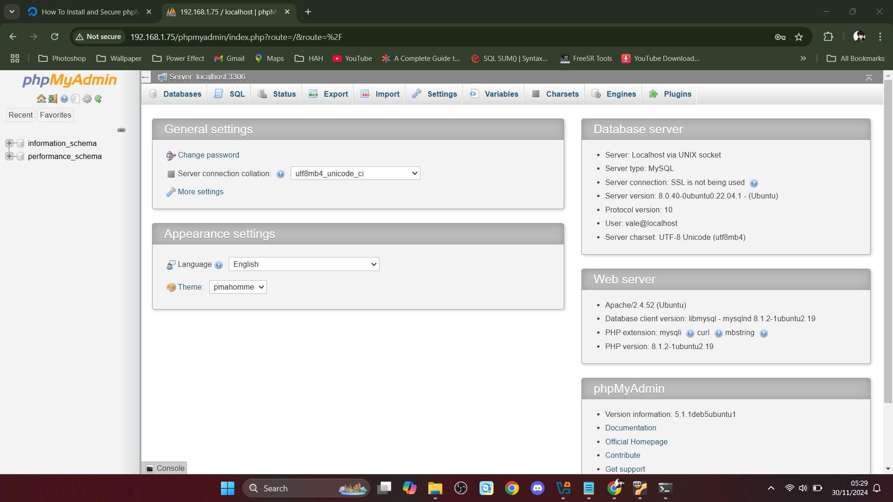
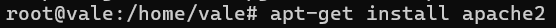
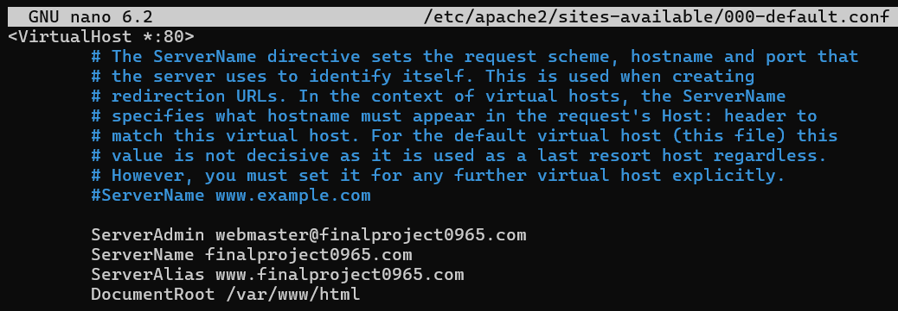

## VALERIAN KALEB SETIAWIRAWAN---FINAL-PROJECT-OS-SERVER-&-SYSTEM-ADMIN---23.83.0965
# Judul : Instalasi layanan server untuk hosting web delivery makanan


Repository ini berisi Dokumentasi Instalasi dan Konfigurasi berbagai layanan Server, seperti SSH, DNS, DHCP, WEB, Database, dll. Saya menggunakan Ubuntu Server versi 22.04 sebagai base operasi sistem saya.
Beberapa Service yang dijelaskan dalam Repository ini masih dalam proses pengembangan, artinya masih ada beberapa service yang progressnya masih 50% jadi, kedepannya akan dikembangkan lagi.

Progress:
- 19 November 2024: Penentuan tema yang di Install
- 29 November 2024: Penyelesaian progress pertama

## Daftar Isi
1. [Instalasi dan Konfigurasi SSH](#1-instalasi-dan-konfigurasi-ssh-server)
2. [Instalasi dan Konfigurasi DHCP Server](#2-instalasi-dan-konfigurasi-dhcp-server)
3. [Instalasi dan Konfigurasi Database Server](#3-instalasi-dan-konfigurasi-database-server)
4. [Instalasi dan Konfigurasi Web Server](#4-instalasi-dan-konfigurasi-web-server)
5. [Instalasi dan Konfigurasi DNS Server](#5-instalasi-dan-konfigurasi-dns-server)
   

## 1. Instalasi dan Konfigurasi SSH Server

### 1.1 Instalasi SSH
**Langkah 1: Lakukan Update paket Ubuntu**
```
apt update
```


**Langkah 2: Lakukan Instalasi Paket SSH Server**
```
apt-get install openssh-server
```
### 1.2 Konfigurasi SSH
**Langkah 1: Buka Direktori konfigurasi ssh dengan text editor(disini saya menggunakan nano)**
```
nano /etc/ssh/sshd_config
```


**Langkah 2: Edit Konfigurasi seperti dibawah ini**


Saya mengubah Port dari 22 ke 4646 untuk mengamankanya agar tidak menggunakan default port.

**Langkah 3: Restart layanan SSH Server**
```
systemctl restart sshd
```


### 1.3 Menguji Konfigurasi
```
ssh root@IPADDR -p 4646
```


Bisa disesuaikan dengan IP dan Port yang anda konfigurasi

### 1.4 Konfigurasi Firewall
**Langkah 1: Mengizinkan lalu lintas TCP yang masuk pada port 4646**
```
ufw allow 4646
```


### 1.5 cek status Firewall
```
ufw status
```


Jika firewall belum aktif, masukkan perintah
```
ufw enable
```

## 2. Instalasi dan Konfigurasi DHCP Server

### 2.1 Instalasi DHCP
**Cek IP**
Sebelum kita menginstall paket DHCP Server, alangkah baiknya kita untuk cek ip address terlebih dahulu kemudian simpan kedalam notepad atau tempat lain agar mempermudah konfigurasi.
```
ip add
```


**Langkah 1: Instalasi Paket DHCP Server**
```
apt-get install isc-dhcp-server
```


### 2.2 Konfigurasi DHCP Server
**Langkah 1: Buka Direktori Konfigurasi DHCPD**
```
nano /etc/dhcp/dhcpd.conf
```


**Langkah 2: Edit Konfigurasi file Seperti dibawah ini**
```
Line 49
# A slightly different configuration for an internal subnet.
#subnet 10.5.5.0 netmask 255.255.255.224 {
#  range 10.5.5.26 10.5.5.30;
#  option domain-name-servers ns1.internal.example.org;
#  option domain-name "internal.example.org";
#  option routers 10.5.5.1;
#  option broadcast-address 10.5.5.31;
#  default-lease-time 600;
#  max-lease-time 7200;
#}
```
Sesuaikan dengan IP Address,Prefix dan Hostname Server Anda


**Langkah 3: Deklarasikan DHCP Server dengan interface yang akan anda fungsikan sebagai DHCP Server**
```
nano /etc/default/isc-dhcp-server
```


Sesuaikan dengan interface yang anda gunakan


**Langkah 4: Restart Layanan DHCPD**
```
systemctl restart isc-dhcp-server
```


### 2.3 Menguji Konfigurasi

Cek Status DHCP Server
```
systemctl status isc-dhcp-server
```


## 3. Instalasi dan Konfigurasi Database Server
Dalam proyek ini, saya melakukan instalasi database server menggunakan MySQL, sebuah sistem manajemen basis data open-source yang kuat. MySQL digunakan untuk menyimpan dan mengelola data yang diperlukan oleh aplikasi dan situs web. Saya juga menginstal phpMyAdmin, antarmuka web yang memudahkan administrasi dan manajemen database MySQL, memungkinkan pengguna untuk dengan mudah membuat, mengedit, dan mengelola basis data melalui antarmuka berbasis web yang intuitif.

### 3.1 Instalasi MySQL

**Langkah 1: Instalasi Paket MySQL**
```
apt update
apt install mysql-server
```


**Langkah 2: Jalankan MySQL**
```
systemctl start mysql.service
systemctl status mysql.service
```


### 3.2 Konfigurasi MySQL
**Langkah 1: Jalankan Perintah ini**
```
mysql_secure_installation
```
**Langkah 2: Ikuti Konfigurasi dibawah ini**

Peringatan: Mulai Juli 2022, sebuah kesalahan akan terjadi ketika Anda menjalankan skrip `mysql_secure_installation` tanpa konfigurasi lebih lanjut. Alasannya adalah skrip ini akan mencoba mengatur kata sandi untuk akun MySQL root instalasi, tetapi, secara default pada instalasi Ubuntu, akun ini tidak dikonfigurasikan untuk terhubung menggunakan kata sandi.

Hal ini akan membawa skrip ke dalam perulangan rekursif yang hanya dapat Anda hentikan dengan menutup jendela terminal Anda.

Karena skrip `mysql_secure_installation` melakukan sejumlah tindakan lain yang berguna untuk menjaga keamanan instalasi MySQL Anda, Anda tetap disarankan untuk menjalankannya sebelum mulai menggunakan MySQL untuk mengelola data Anda. Namun, untuk menghindari perulangan ini, Anda perlu menyesuaikan terlebih dahulu cara autentikasi pengguna root MySQL Anda.

Pertama, buka prompt MySQL:
```
sudo mysql
```


Kemudian jalankan perintah `ALTER USER` berikut ini untuk mengubah metode autentikasi pengguna root menjadi metode yang menggunakan kata sandi. Contoh berikut ini mengubah metode autentikasi menjadi `mysql_native_password`:
```
ALTER USER 'root'@'localhost' IDENTIFIED WITH mysql_native_password BY 'password';
```


Setelah melakukan perubahan ini, keluarlah dari prompt MySQL:
```
mysql> exit
```
Jalankan scriptnya lagi dengan:
```
mysql_secure_installation
```


Pertanyaan pertama akan menanyakan apakah Anda ingin menyiapkan Plugin Validasi Kata Sandi, yang dapat digunakan untuk menguji kekuatan kata sandi pengguna MySQL baru sebelum menganggapnya valid.

Jika Anda memilih untuk menyiapkan Plugin Validasi Kata Sandi, setiap pengguna MySQL yang Anda buat yang mengautentikasi dengan kata sandi akan diminta untuk memiliki kata sandi yang sesuai dengan kebijakan yang Anda pilih:


Dari sini, Anda dapat menekan Y dan kemudian ENTER untuk menerima default untuk semua pertanyaan berikutnya. Ini akan menghapus beberapa pengguna anonim dan basis data uji, menonaktifkan login root jarak jauh, dan memuat aturan baru ini sehingga MySQL segera menghormati perubahan yang Anda buat.


Setelah skrip keamanan selesai, Anda dapat membuka kembali MySQL dan mengubah metode autentikasi pengguna root kembali ke metode default,` auth_socket`. Untuk mengautentikasi sebagai pengguna root MySQL menggunakan kata sandi, jalankan perintah ini:
```
mysql -u root -p
```


Kemudian kembali menggunakan metode autentikasi default dengan menggunakan perintah ini:
```
ALTER USER 'root'@'localhost' IDENTIFIED WITH auth_socket;
```


Namun saya memilih untuk membiarkan metode autentikasi pengguna root tetap `mysql_native_password`
### 6.4 Instalasi dan Konfigurasi Phpmyadmin

**Langkah 1: Lakukan instalasi paket**
```
apt-get install phpmyadmin
```


**Langkah 2: Konfigurasi Phpmyadmin**
Peringatan: Saat prompt muncul, “apache2” disorot, tetapi tidak dipilih. Jika Anda tidak menekan SPASI untuk memilih Apache, installer tidak akan memindahkan file yang diperlukan selama instalasi. Tekan SPASI, TAB, lalu ENTER untuk memilih Apache.


Jika anda tetap membiarkan metorde autentikasi pengguna root tetap `mysql_native_password`, maka akan memicu kesalahan saat Anda mencoba mengatur kata sandi untuk pengguna phpmyadmin:


Untuk mengatasinya, pilih opsi batalkan untuk menghentikan proses instalasi. Kemudian, buka prompt MySQL Anda:
```
mysql -u root -p
```


Dari prompt, jalankan perintah berikut untuk menonaktifkan komponen Validasi Kata Sandi. Perhatikan bahwa ini tidak akan benar-benar menghapus instalasinya, tetapi hanya menghentikan komponen agar tidak dimuat pada server MySQL Anda:
```
UNINSTALL COMPONENT "file://component_validate_password";
```


Kemudian keluar dari MySQL client dan menginstal paket phpmyadmin lagi
```
apt-get install phpmyadmin
```


Setelah phpMyAdmin terinstal, Anda dapat membuka prompt MySQL sekali lagi dengan sudo mysql atau mysql -u root -p lalu jalankan perintah berikut ini untuk mengaktifkan kembali komponen Validasi Kata Sandi:
```
INSTALL COMPONENT "file://component_validate_password";
```


 ### 3.4 Menguji Konfigurasi 

**Langkah 1: aktifkan file konfigurasi Apache untuk phpMyAdmin**
```
a2enconf phpmyadmin.conf
```


**Langkah 2: Mengonfigurasi Akses Kata Sandi untuk Pengguna MySQL Khusus **
Masuk kedalam Shell MySQL lagi lalu buat user
```
mysql -u root -p
CREATE USER 'username'@'localhost' IDENTIFIED WITH mysql_native_password BY 'password';
```

Kemudian, berikan hak istimewa yang sesuai kepada pengguna baru Anda. Sebagai contoh, Anda dapat memberikan hak istimewa kepada pengguna ke semua tabel dalam database, serta kekuasaan untuk menambah, mengubah, dan menghapus hak istimewa pengguna, dengan perintah ini:
```
GRANT ALL PRIVILEGES ON *.* TO 'username'@'localhost' WITH GRANT OPTION;
```
Lalu keluar dari shell
```
mysql> exit
```
**Langkah 3: Akses web interface**
Buka browser lalu isi ip atau domain yang telah di konfigurasi ke kolom pencarian
`https://your_domain_or_IP/phpmyadmin`


login menggunakan akun yang tadi telah dibuat


## 4. Instalasi dan Konfigurasi Web Server
Saya memilih untuk menggunakan Apache2 sebagai server web utama untuk proyek saya daripada Nginx. tidak ada alasan khusus saya memilih apache2,anda bisa memilih Nginx. saya juga akan menginstall CMS wordpress untuk Webserver ini. Apache2 memiliki dukungan yang baik untuk PHP, yang merupakan salah satu persyaratan utama untuk menjalankan WordPress dengan lancar.

### 4.1 Instalasi Apache2

**Langkah 1: Instalasi Paket Apache2**
```
apt update && apt upgrade
apt-get install apache2
```



### 4.2 Konfigurasi Apache2
**Langkah 1: Buka File Konfigurasi Apache2**
```
nano /etc/apache2/sites-available/000-default.conf
```


**Langkah 2: Sesuaikan Konfigurasi ini dengan domain yang anda gunakan**


**Lengkah 3: Restart Layanan Apache2**
```
systemctl restart apache2
```


**Langkah 4: Cek Apache2**
```
systemctl status apache2
```


Konfigurasi ufw
```
ufw allow in "Apache"
ufw status
```


Jika Konfigurasi Berhasil seharusnya muncul layanan web default seperti gambar dibawah ini:


### 4.3 Konfigurasi CMS Wordpress pada Apache2

**Langkah 1: Melakukan Instalasi PHP**
```
sudo apt install -y php libapache2-mod-php php-{common,xml,xmlrpc,curl,gd,imagick,cli,dev,imap,mbstring,opcache,soap,zip,intl}
```


cek versi php
```
php -v
```


**Langkah 2: Melakukan Instalasi Database Server**

Untuk ini sudah dibuat bab lain jadi anda bisa cek ke [Instalasi dan Konfigurasi Database Server](#3-instalasi-dan-konfigurasi-database-server)

**Langkah 3: Buat Database untuk wordpress**

login ke Database Terlebih dahulu:
```
mysql -u root -p
```


buat database untuk Wordpress dan berikan password sesuai keinginan anda
```
CREATE DATABASE wordpress;
CREATE USER 'wordpressuser'@'localhost' IDENTIFIED BY 'password';
GRANT ALL PRIVILEGES ON wordpress.* TO 'wordpressuser'@'localhost';
FLUSH PRIVILEGES;
EXIT;
```


**Langkah 4: Download dan Extract Paket Wordpress**
```
cd /tmp && wget https://wordpress.org/latest.tar.gz
tar -xvf latest.tar.gz
```


**Langkah 5: Salin direktori wordpress ke dalam direktori /var/www/html.**
```
cp -R wordpress /var/www/html/
```


**Langkah 6: Mengubah kepemilikan direktori /var/www/html/wordpress. dan Memodifikasi izin file.**
```
chown -R www-data:www-data /var/www/html/wordpress/
chmod -R 755 /var/www/html/wordpress/
```


**Langkah 8: Salin wp-config-sample.php dan ubah kepemilikan berkas wp-config.php.**
```
cd /var/www/html/wordpress
cp wp-config-sample.php wp-config.php
chown www-data:www-data wp-config.php
```


**Langkah 9: Edit file wp-config.php dan tambahkan baris di bawah ini pada file wp-config.php.**
```
nano wp-config.php
```


**Langkah 10: Tambahkan secure values dari wordpress secret key generator**
```
curl -s https://api.wordpress.org/secret-key/1.1/salt/
```
Salin nilai ini dan tambahkan di file wp-config.php


**Langkah 11: Konfigurasikan apache untuk memuat wordpress sebagai situs utama.**
```
cd /etc/apache2/sites-available
cp 000-default.conf wordpress.conf
```


Masuk kedalam file wordpress.conf
```
nano wordpress.conf
```


Edit file wordpress.conf dan tambahkan baris di bawah ini


Aktifkan WordPress.conf dan nonaktifkan 000-default.conf dan muat ulang layanan apache.
```
a2ensite wordpress.conf
a2dissite 000-default.conf
service apache2 reload
```


**Langkah 12: Instalasi Admin Wordpress**

1. Pilih Bahasa yang diinginkan 


2. Isi Nama situs,Password,dan Email


3. Login dengan Akun yang sudah dibuat


4. CMS sudah Berhasil diinstall


### 4.4 Pengujian Konfigurasi Apache2

Tampilan dari Postingan yang ada di Webserver


## 5. Instalasi dan Konfigurasi DNS Server

### 5.1 Instalasi BIND9

**Langkah 1: Instalasi Paket bind9**
```
apt update
apt-get install bind9
```


### 5.2 Konfigurasi BIND9

**Langkah 1: copy file untuk Konfigurasi "Forward" dan "Reverse"**
```
cd /etc/bind
cp db.local db.forward
cp db.127 db.reverse
```


**Langkah 2: Konfigurasi file db.forward**
```
nano db.forward
```


Ubahlah Konfigurasi seperti dibawah ini:


disesuaikan dengan domain anda

**Langkah 3: Konfigurasi file db.reverse**
```
nano db.reverse
```


ubahlah Konfigurasi seperti dibawah ini:


**Langkah 4: Buka Konfigurasi named.conf.local untuk konfigurasi DNS Zones**
```
nano named.conf.local
```


Ubahlah isi file konfigurasi seperti dibawah ini:


**Langkah 5: Konfigurasi Forwarders**
```
nano named.conf.options
```


tambahkan DNS forwarders


**Langkah 6: Konfigurasi DNS diperangkat Server**
```
nano /etc/resolv.conf
```


ubahlah jadi seperti ini:


**Langkah 7: Restart Layanan Bind9**
```
systemctl restart bind9
```


### 5.3 Pengujian Konfigurasi DNS

**Langkah 1: Instalasi paket dns resolver**
```
apt-get install dnsutils
```
**Langkah 2: Lakukan pengujian dengan nslookup**


